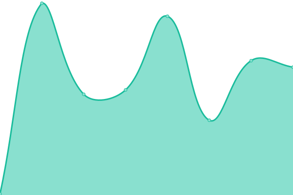

# [📈 Live Status](https://status.krea.to): <!--live status--> **🟧 Partial outage**

This repository contains the open-source uptime monitor and status page for [Kreato](https://krea.to), powered by [Upptime](https://github.com/upptime/upptime).

With [Upptime](https://upptime.js.org), you can get your own unlimited and free uptime monitor and status page, powered entirely by a GitHub repository. We use [Issues](https://github.com/kreatoo/status.krea.to/issues) as incident reports, [Actions](https://github.com/kreatoo/status.krea.to/actions) as uptime monitors, and [Pages](https://status.krea.to) for the status page.

<!--start: status pages-->
<!-- This summary is generated by Upptime (https://github.com/upptime/upptime) -->
<!-- Do not edit this manually, your changes will be overwritten -->
<!-- prettier-ignore -->
| URL | Status | History | Response Time | Uptime |
| --- | ------ | ------- | ------------- | ------ |
|  [iris](https://iris.krea.to) | 🟩 Up | [iris.yml](https://github.com/bouquet2/status.krea.to/commits/HEAD/history/iris.yml) | 

 596ms
     
 | 

<a href="https://status.krea.to/history/iris">99.07%</a>
    

|  [lily](https://lily.krea.to) | 🟩 Up | [lily.yml](https://github.com/bouquet2/status.krea.to/commits/HEAD/history/lily.yml) | 

 593ms
     
 | 

<a href="https://status.krea.to/history/lily">99.36%</a>
    

|  [lb](https://lb.krea.to) | 🟩 Up | [lb.yml](https://github.com/bouquet2/status.krea.to/commits/HEAD/history/lb.yml) | 

 616ms
     
 | 

<a href="https://status.krea.to/history/lb">99.36%</a>
    

|  [MinIO](https://s3.krea.to) | 🟩 Up | [min-io.yml](https://github.com/bouquet2/status.krea.to/commits/HEAD/history/min-io.yml) | 

 645ms
     
 | 

<a href="https://status.krea.to/history/min-io">88.65%</a>
    

|  [binrepo](https://bin.kreato.dev) | 🟩 Up | [binrepo.yml](https://github.com/bouquet2/status.krea.to/commits/HEAD/history/binrepo.yml) | 

 891ms
     
 | 

<a href="https://status.krea.to/history/binrepo">88.56%</a>
    

|  [koito](https://fm.krea.to) | 🟥 Down | [koito.yml](https://github.com/bouquet2/status.krea.to/commits/HEAD/history/koito.yml) | 

 663ms
     
 | 

<a href="https://status.krea.to/history/koito">98.87%</a>
    

|  [umami](https://umami.krea.to/dashboard) | 🟥 Down | [umami.yml](https://github.com/bouquet2/status.krea.to/commits/HEAD/history/umami.yml) | 

 676ms
     
 | 

<a href="https://status.krea.to/history/umami">98.87%</a>
    

|  [n8n](https://n8n.krea.to) | 🟥 Down | [n8n.yml](https://github.com/bouquet2/status.krea.to/commits/HEAD/history/n8n.yml) | 

 626ms
     
 | 

<a href="https://status.krea.to/history/n8n">98.94%</a>
    

|  [mirror](https://mirror.kreato.dev) | 🟩 Up | [mirror.yml](https://github.com/bouquet2/status.krea.to/commits/HEAD/history/mirror.yml) | 

 4815ms
     
 | 

<a href="https://status.krea.to/history/mirror">88.68%</a>
    

|  [main](https://krea.to) | 🟩 Up | [main.yml](https://github.com/bouquet2/status.krea.to/commits/HEAD/history/main.yml) | 

 151ms
     
 | 

<a href="https://status.krea.to/history/main">100.00%</a>
    

|  [llm](https://llm.krea.to/v1/) | 🟥 Down | [llm.yml](https://github.com/bouquet2/status.krea.to/commits/HEAD/history/llm.yml) | 

 681ms
     
 | 

<a href="https://status.krea.to/history/llm">98.86%</a>
    

|  [klinux](https://linux.kreato.dev) | 🟩 Up | [klinux.yml](https://github.com/bouquet2/status.krea.to/commits/HEAD/history/klinux.yml) | 

 182ms
     
 | 

<a href="https://status.krea.to/history/klinux">100.00%</a>
    

|  [media](https://media.krea.to) | 🟥 Down | [media.yml](https://github.com/bouquet2/status.krea.to/commits/HEAD/history/media.yml) | 

 908ms
     
 | 

<a href="https://status.krea.to/history/media">98.86%</a>
    

<!--end: status pages-->

[**Visit our status website →**](https://status.krea.to)

## 📄 License

- Powered by: [Upptime](https://github.com/upptime/upptime)
- Code: [MIT](./LICENSE) © [Anand Chowdhary](https://anandchowdhary.com), supported by [Pabio](https://pabio.com)
- Data in the `./history` directory: [Open Database License](https://opendatacommons.org/licenses/odbl/1-0/)
